Examination of U251 cell transcriptome profile after treatment with
sevoflurane by DE analysis of GSE193295 data.
================

The scope of the analysis, as declared in GEO’s summary, is: *To explore
the possible mechanisms of Sev inducing ferroptosis in glioma cells,
\[by\] RNA sequencing to screening differential expressed genes between
sevoflurane-treated and sevoflurane-treated U251 cells.*

After loading necessary libraries we import the count table into the
environment and create the metadata which contains the design formula as
column (sampletype). This column has two factor levels which tells
DESeq2 that for each gene we want to evaluate gene expression change
with respect to these different levels.

``` r
library(ggplot2)
library(DESeq2)
library(pheatmap)
library(RColorBrewer)
library(tidyverse)
library(plotly)
library(annotables)
library(org.Hs.eg.db)
library(AnnotationDbi)
library(clusterProfiler)
library(pathview)
```

``` r
matrix <- read.delim('GSE193295_gene_sample_count.txt', row.names = 'gene_ID')

conditions <- c('control', 'treated')
sampletype <- factor(rep(conditions, each = 3))
metadata <- data.frame(sampletype, row.names = colnames(matrix))

metadata
```

    ##           sampletype
    ## control_1    control
    ## control_2    control
    ## control_3    control
    ## sev_1        treated
    ## sev_2        treated
    ## sev_3        treated

Now let’s check the characteristics of data, in particular the mean and
the variance, to know which model we are going to use.

``` r
# mean and variance

mean <- apply(matrix, 1, mean)
var <- apply(matrix, 1, var)

ggplot(data.frame(mean, var), aes(x=mean, y=var)) + 
  geom_point() + 
  scale_y_log10(limits = c(1,1e9)) +
  scale_x_log10(limits = c(1,1e9)) +
  geom_abline(intercept = 0, slope = 1, color="red")
```

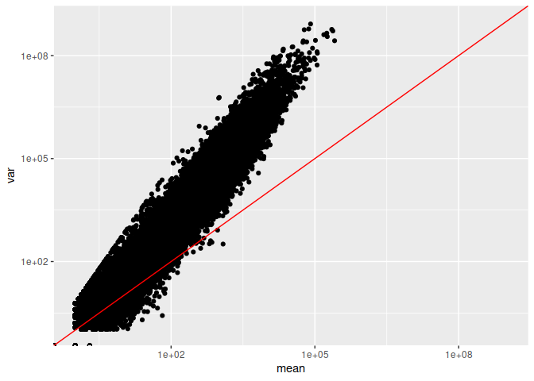<!-- -->

The plot clearly shows that the variance across replicates tends to be
greater than the mean and especially for genes with large mean
expression levels.

This indicates that our data do not fit the Poisson distribution where
mean = variance which would have been the best model for RNA-seq data.
Therefore the model that fits best in this case is the Negative Binomial
distribution where the mean \< variance.

## Quality Control

To explore the variation across our samples, we will be performing
Principal Component Analysis (PCA) and hierarchical clustering methods.

To improve the distances/clustering for the PCA and heirarchical
clustering visualization methods, we need to moderate the variance
across the mean by applying the rlog transformation to the normalized
counts. First, we have to create a DESeqDataSet object and estimate the
size factors.

``` r
dds <- DESeqDataSetFromMatrix(matrix, 
                              colData = metadata, 
                              design = ~ sampletype)

dds <- estimateSizeFactors(dds)

size.factors <- sizeFactors(dds)
size.factors
```

    ## control_1 control_2 control_3     sev_1     sev_2     sev_3 
    ## 1.0566335 0.9830814 1.2065288 0.9344659 0.9339200 0.9814983

### Principal components analysis (PCA)

``` r
# Transform counts for data visualization

rld <- rlog(dds, blind = T)

colnames(rld) <- sampletype
```

``` r
# Plot PCA 

plotPCA(rld, intgroup = 'sampletype')
```

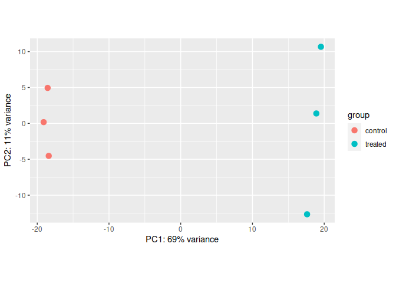<!-- -->

PCA shows a clear separation along the PC1 axis and the clustering of
the two different sample types. This indicates the ‘treatment condition’
as principal source of variation for the two sample groups.

### Hierarchical Clustering

``` r
colnames(rld) <- rownames(metadata)

rld %>% assay() %>% cor() %>% pheatmap(angle_col = 315)
```

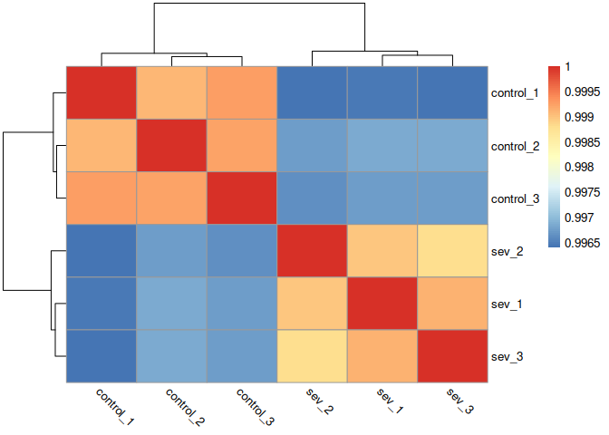<!-- -->

HC shows pretty high correlations (\> 0.999) confirming the results of
PCA analysis. These two plots both suggest that the data are of good
quality and we can proceed to differential expression analysis.

## Differential expression analysis with DESeq2

``` r
dds <- DESeq(dds)
```

Size factors values for each sample:

``` r
sizeFactors(dds)
```

    ## control_1 control_2 control_3     sev_1     sev_2     sev_3 
    ## 1.0566335 0.9830814 1.2065288 0.9344659 0.9339200 0.9814983

``` r
# Let's check last and previous size factors

identical(sizeFactors(dds), size.factors)
```

    ## [1] TRUE

Dispersion estimates and shrinkage:

``` r
plotDispEsts(dds)
```

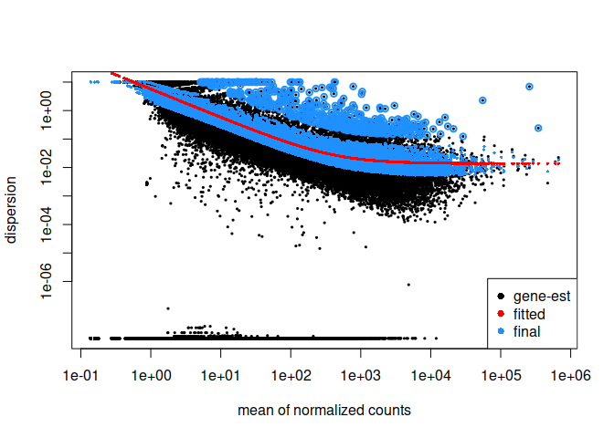<!-- -->

The plot represents the shrinkage of estimated dispersion per gene
performed by DESeq() function. Since data scatter around the curve, with
the dispersion decreasing while increasing mean expression levels, we
can be assured by the good fit of data for DESeq2 model.

### Contrasts and results table

We are going to use the Wald test as statistical test for groups
comparison. To indicate to DESeq2 the two groups we want to compare, we
provide a vector to `contrast` argument in `results()` function which
contains the `sampletype` vector, the numerator and the denominator of
ratio. We are going to set alpha = 0.05.

``` r
# Define contrasts, extract results table, and shrink the log2 fold changes

contrasts <- c('sampletype', 'treated', 'control')

res_table <- results(dds, contrast = contrasts, alpha = 0.05)
```

### Shrunken log2 foldchanges (LFC) and MA Plot

Before having a look into the results, we have to generate more accurate
log2 fold change estimates by using the *shrinkage of the LFC
estimates*. The *MA plot* shows the mean of the normalized counts versus
the log2 fold changes for all genes tested. The genes that are
significantly DE are red colored to be easily identified.

``` r
# Saving unshrunken result table into a variable

res_table_unshrunken <- res_table

# LFC Shrinking

resultsNames(dds)
```

    ## [1] "Intercept"                     "sampletype_treated_vs_control"

``` r
res_table <- lfcShrink(dds=dds, 
                       coef=2, #2 del resultsNames
                       #contrast = contrasts,
                       res=res_table)

# MA plot unshrunken

plotMA(res_table_unshrunken, ylim=c(-10,10))
```

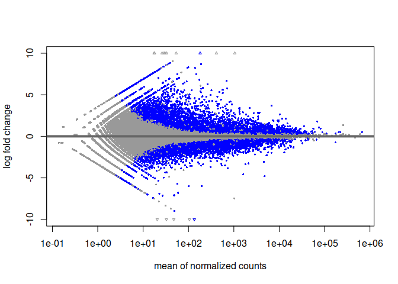<!-- -->

And now the shrunken results:

``` r
plotMA(res_table, ylim=c(-10,10))
```

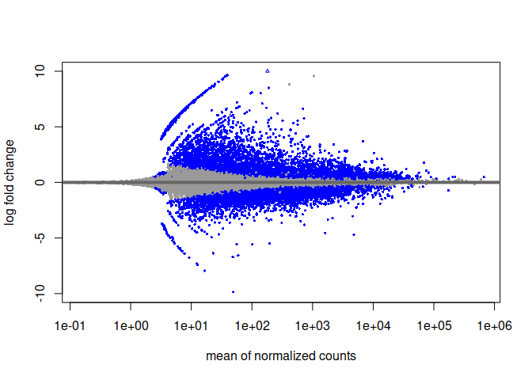<!-- -->

The comparison of the two plots shows a slight shrinkage towards zero of
genes LFCs.

### Summarizing results

``` r
# Summarize results

summary(res_table, alpha = 0.05)
```

    ## 
    ## out of 47106 with nonzero total read count
    ## adjusted p-value < 0.05
    ## LFC > 0 (up)       : 6382, 14%
    ## LFC < 0 (down)     : 5518, 12%
    ## outliers [1]       : 57, 0.12%
    ## low counts [2]     : 10783, 23%
    ## (mean count < 2)
    ## [1] see 'cooksCutoff' argument of ?results
    ## [2] see 'independentFiltering' argument of ?results

Out of the 47106 genes analyzed (with nonzero total read count and
adjusted p-value \< 0.05), 14% have LFC \> 0 and 12% have LFC \< 0.
Besides, 23% have no multiple test correction due to their low counts
(mean count \< 2) therefore their adj-p-value is set to NA. 0.12% are
outliers and their p-value and adj-p-value in result table are both set
to NA.

### Extracting significant differentially expressed genes

We subset the results table to only include those that are significant
using the `filter()` function after converting the results table into a
tibble:

``` r
res_table_tb <- res_table %>% as.data.frame() %>%
                tibble::rownames_to_column(var='gene') %>%
                tibble::as_tibble()

sigDEG <- res_table_tb %>% 
          filter(padj < 0.05 & abs(log2FoldChange) > 1)
```

``` r
# Visualizing significant differentially expressed genes table

sigDEG
```

    ## # A tibble: 5,503 × 6
    ##    gene            baseMean log2FoldChange lfcSE   pvalue     padj
    ##    <chr>              <dbl>          <dbl> <dbl>    <dbl>    <dbl>
    ##  1 ENSG00000261606     52.2           3.52 0.550 1.25e-11 2.97e-10
    ##  2 ENSG00000254141     31.1           1.09 0.532 7.47e- 3 2.62e- 2
    ##  3 ENSG00000283689     21.1          -1.62 0.813 3.67e- 3 1.44e- 2
    ##  4 ENSG00000149243    299.            1.52 0.256 4.37e-10 8.18e- 9
    ##  5 ENSG00000286068     12.4           1.41 0.872 9.72e- 3 3.26e- 2
    ##  6 ENSG00000163462    235.           -2.11 0.283 9.72e-15 3.61e-13
    ##  7 ENSG00000162599   1904.           -1.65 0.624 7.25e- 4 3.59e- 3
    ##  8 ENSG00000259165     75.9          -1.81 0.301 2.36e-10 4.64e- 9
    ##  9 ENSG00000238485     11.1           3.92 1.17  7.87e- 5 5.11e- 4
    ## 10 ENSG00000055070   6412.            1.14 0.451 2.20e- 3 9.31e- 3
    ## # … with 5,493 more rows

### Visualizing the results

We need gene symbols for the plots below hence we fetch them from
`org.Hs.eg.db` database and put them into a new normalized count table.

``` r
# Fetching gene symbols

annotations <- AnnotationDbi::select(org.Hs.eg.db,
                                     keys = res_table_tb$gene,
                                     columns = c('SYMBOL', 'ENTREZID', 'GENENAME'),
                                     keytype = 'ENSEMBL')

# Creating final normalized counts

normalized_counts <- counts(dds, normalized = T) %>% 
                     data.frame() %>%
                     rownames_to_column(var="gene") %>%
                     as_tibble()

# Merging the normalized counts data frame with the annotations table by ensembl id

grch38annot <- annotations %>% 
  dplyr::select(ENSEMBL, SYMBOL) %>% 
  dplyr::distinct()

normalized_counts <- merge(normalized_counts, grch38annot, by.x="gene", by.y="ENSEMBL")

# Creating a tibble for the normalized counts

normalized_counts <- normalized_counts %>%
  as_tibble()

# Reshaping the column order

normalized_counts <- normalized_counts[,c('gene', 'SYMBOL', 'control_1', 'control_2', 'control_3', 'sev_1', 'sev_2', 'sev_3')]
```

Now we can plot the top 10 Significant DE genes:

``` r
# Fetching the gene names' 10 most significant LFC

top10_sig_genes <- sigDEG %>% 
                   arrange(padj) %>%
                   pull(gene) %>%
                   head(10)

# Subsetting the normalized_counts

top10_sig_genes <- normalized_counts[which(normalized_counts$gene %in% top10_sig_genes ),]

top10_sig_genes
```

    ## # A tibble: 10 × 8
    ##    gene            SYMBOL    control_1 control_2 control_3  sev_1  sev_2  sev_3
    ##    <chr>           <chr>         <dbl>     <dbl>     <dbl>  <dbl>  <dbl>  <dbl>
    ##  1 ENSG00000091128 LAMB4          25.6      24.4      19.9  1156.  1053.  1130.
    ##  2 ENSG00000174038 C9orf131       28.4      23.4      24.9  1304.  1267.  1676.
    ##  3 ENSG00000180573 H2AC6        2512.     3717.     3079.    110.   163.   117.
    ##  4 ENSG00000182648 LINC01006      61.5      52.9      59.7   855.   843.   936.
    ##  5 ENSG00000279608 <NA>          400.      339.      404.   4228.  3744.  4200.
    ##  6 MSTRG.11005     <NA>           71.9      81.4     114.   1648.  1524.  1651.
    ##  7 MSTRG.13783     <NA>          860.     1025.      918.   6454.  6768.  5719.
    ##  8 MSTRG.13991     <NA>         1253.     1199.     1290.   5845.  5639.  5463.
    ##  9 MSTRG.15244     <NA>         1009.     1004.      903.  13028. 11710. 13183.
    ## 10 MSTRG.3005      <NA>         3528.     2927.     3322.    315.   290.   338.

Since not all gene symbols are available, we are going to fill na values
with ensembl ids:

``` r
top10_sig_genes$SYMBOL[which(is.na(top10_sig_genes$SYMBOL))] <- top10_sig_genes$gene[which(is.na(top10_sig_genes$SYMBOL))]

top10_sig_genes
```

    ## # A tibble: 10 × 8
    ##    gene            SYMBOL     control_1 control_2 control_3  sev_1  sev_2  sev_3
    ##    <chr>           <chr>          <dbl>     <dbl>     <dbl>  <dbl>  <dbl>  <dbl>
    ##  1 ENSG00000091128 LAMB4           25.6      24.4      19.9  1156.  1053.  1130.
    ##  2 ENSG00000174038 C9orf131        28.4      23.4      24.9  1304.  1267.  1676.
    ##  3 ENSG00000180573 H2AC6         2512.     3717.     3079.    110.   163.   117.
    ##  4 ENSG00000182648 LINC01006       61.5      52.9      59.7   855.   843.   936.
    ##  5 ENSG00000279608 ENSG00000…     400.      339.      404.   4228.  3744.  4200.
    ##  6 MSTRG.11005     MSTRG.110…      71.9      81.4     114.   1648.  1524.  1651.
    ##  7 MSTRG.13783     MSTRG.137…     860.     1025.      918.   6454.  6768.  5719.
    ##  8 MSTRG.13991     MSTRG.139…    1253.     1199.     1290.   5845.  5639.  5463.
    ##  9 MSTRG.15244     MSTRG.152…    1009.     1004.      903.  13028. 11710. 13183.
    ## 10 MSTRG.3005      MSTRG.3005    3528.     2927.     3322.    315.   290.   338.

``` r
# Gather the columns to have normalized counts to a single column

gathered_top10_sig_genes <- top10_sig_genes %>%
  gather(colnames(top10_sig_genes)[3:8], key = "samplename", value = "normalized_counts")

# Add a column with sample type for each sample

gathered_top10_sig_genes$sampletype <- rep(c('control', 'treated'), each=30)

# View "gathered" data frame

gathered_top10_sig_genes
```

    ## # A tibble: 60 × 5
    ##    gene            SYMBOL          samplename normalized_counts sampletype
    ##    <chr>           <chr>           <chr>                  <dbl> <chr>     
    ##  1 ENSG00000091128 LAMB4           control_1               25.6 control   
    ##  2 ENSG00000174038 C9orf131        control_1               28.4 control   
    ##  3 ENSG00000180573 H2AC6           control_1             2512.  control   
    ##  4 ENSG00000182648 LINC01006       control_1               61.5 control   
    ##  5 ENSG00000279608 ENSG00000279608 control_1              400.  control   
    ##  6 MSTRG.11005     MSTRG.11005     control_1               71.9 control   
    ##  7 MSTRG.13783     MSTRG.13783     control_1              860.  control   
    ##  8 MSTRG.13991     MSTRG.13991     control_1             1253.  control   
    ##  9 MSTRG.15244     MSTRG.15244     control_1             1009.  control   
    ## 10 MSTRG.3005      MSTRG.3005      control_1             3528.  control   
    ## # … with 50 more rows

``` r
# Plot using ggplot2

ggplot(gathered_top10_sig_genes) +
  geom_point(aes(x = SYMBOL, y = normalized_counts, color = sampletype)) +
  scale_y_log10() +
  xlab("Genes") +
  ylab("log10 Normalized Counts") +
  ggtitle("Top 10 Significant DE Genes") +
  theme_bw() +
  theme(axis.text.x = element_text(angle = 45, hjust = 1)) +
  theme(plot.title = element_text(hjust = 0.5))
```

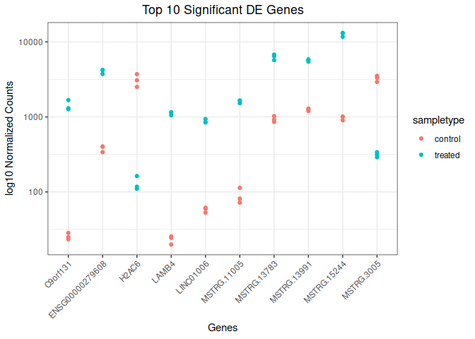<!-- -->

### Heatmap

Here, we extract the normalized values of significant genes and plot a
heatmap of their expression using `pheatmap()`.

``` r
# Extract normalized expression for significant genes 

sigDEG_counts <- normalized_counts %>% filter(gene %in% sigDEG$gene)

# Plot heatmap

pheatmap(sigDEG_counts[,3:8], 
         scale = 'row', 
         angle_col = 315,
         show_rownames = F,
         annotation  = metadata)
```

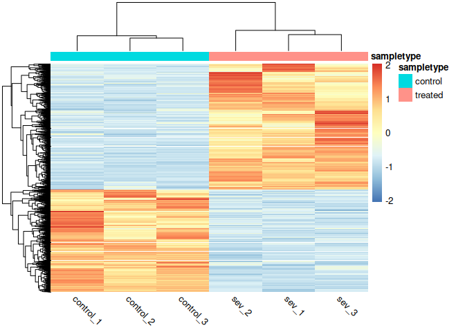<!-- -->

Heatmap shows a good clusterization of LCF \< 0 (blue bars) and LFC \> 0
(red bars) genes between the two sample types.

### Volcano plot

Volcano plot is useful for a global view of padj values and fold changes
distribution among all genes. This allows us to identify significant DE
genes (blue dots).

``` r
# Insert a logical column for significant DE genes and sort padj column

res_table_tb <- res_table_tb %>% 
  mutate(threshold_OE = padj < 0.05 & abs(log2FoldChange) >= 1) %>% arrange(padj)

# Insert symbol column with the first 10 values and fill with NA values

res_table_tb$SYMBOL <- c(top10_sig_genes$SYMBOL, rep(NA, (length(res_table[,1]) - 10)))

# Plot Volcano Plot

ggplot(res_table_tb, aes(name = gene)) +
  geom_point(aes(x = log2FoldChange, y = -log10(padj), colour = threshold_OE)) +
  geom_text(aes(x = log2FoldChange, y = -log10(padj), label = SYMBOL), check_overlap = T) +
  ggtitle("Volcano Plot") +
  xlab("log2 fold change") + 
  ylab("-log10 adjusted p-value") +
  scale_y_continuous(limits = c(0,240)) +
  theme(legend.position = "none",
        plot.title = element_text(size = rel(1.5), hjust = 0.5),
        axis.title = element_text(size = rel(1.25))) 
```

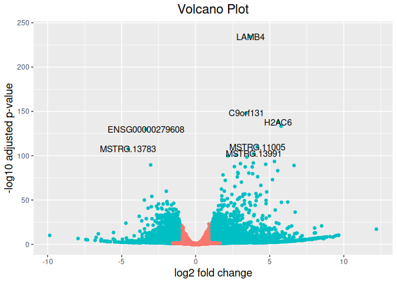<!-- -->

## Functional analysis

``` r
# Removing NA values and duplicates in annotations

annotations <- annotations[which(!is.na(annotations$SYMBOL)),] 
annotations <- annotations[which(!duplicated(annotations$SYMBOL)),]
```

### Cluster profiling

We will be using `clusterProfiler` to perform over-representation
analysis on GO terms associated with our list of significant genes. The
tool takes as input a significant gene list and a background gene list
and performs statistical enrichment analysis using hypergeometric
testing.

``` r
res_table_ann <- merge(res_table_tb, annotations, by.x = 'gene', by.y = 'ENSEMBL')

library(clusterProfiler)
ego <- enrichGO(gene = sigDEG$gene, 
                     universe = res_table_ann$gene,
                     keyType = "ENSEMBL",
                     OrgDb = org.Hs.eg.db, 
                     ont = "BP", 
                     pAdjustMethod = "BH", 
                     qvalueCutoff = 0.05, 
                     readable = TRUE)

data.frame(ego) %>% View()
```

GO enrichment gave only 12 gene ontology terms. P-values, adj-p-values
and their relative q-values are quite nearly the cut off but still
significant. Now we plot the the processes associated with the GO terms
related to their adj-p-values and gene ratios.

``` r
barplot(ego); dotplot(ego, showCategory = 15) 
```

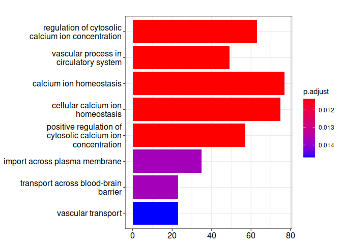<!-- -->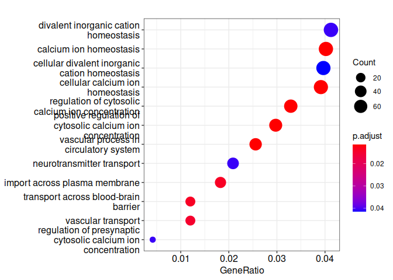<!-- -->

Now we show up genes associated with relative biological process.

``` r
# Category netplot

sigDEG_foldchanges <- sigDEG$log2FoldChange
names(sigDEG_foldchanges) <- sigDEG$gene

goplot(ego);
```

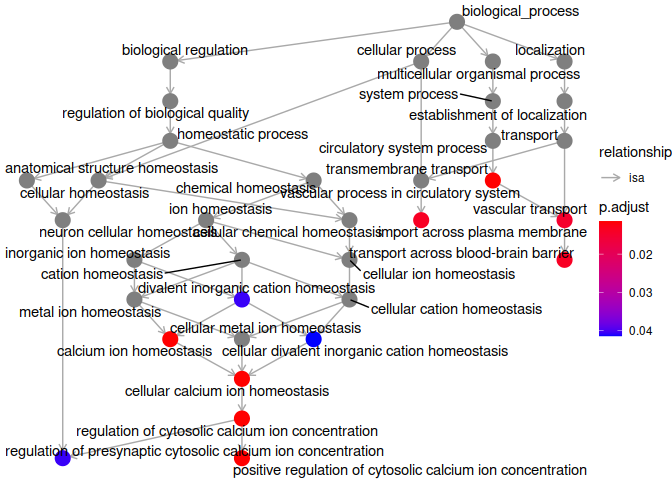<!-- -->

``` r
cnetplot(ego, 
         categorySize="pvalue", 
         showCategory = 3, 
         foldChange=sigDEG_foldchanges, 
         vertex.label.font=6)
```

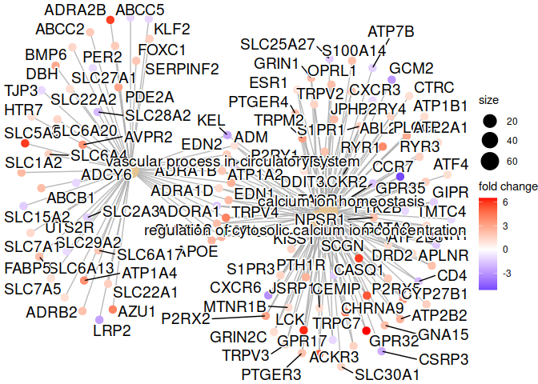<!-- -->

From the plots above, it seems that significant genes are associated
with essentially two different biological processes: **cellular calcium
ion homeostasis** and **vascular transport**. **Ferroptosis**
(*<GO:0097707>*) has not been found among biological processes:

``` r
ego_result <- ego@result %>% as.data.frame()
ego_result[which(ego_result$ID == 'GO:0097707'),]
```

    ## [1] ID          Description GeneRatio   BgRatio     pvalue      p.adjust   
    ## [7] qvalue      geneID      Count      
    ## <0 rows> (or 0-length row.names)

However, 12 genes associated in literature with ferroptosis are among
significant expressed genes:

``` r
# Genes associated with ferroptosis

genes
```

    ##  [1] "ACSL1"    "ACSL3"    "ACSL4"    "ACSL5"    "ACSL6"    "AIFM2"   
    ##  [7] "AKR1C1"   "AKR1C2"   "AKR1C3"   "ALOX15"   "ATG5"     "ATG7"    
    ## [13] "BACH1"    "CBS"      "CHMP5"    "CHMP6"    "CISD1"    "COQ2"    
    ## [19] "CP"       "CTH"      "CYBB"     "DPP4"     "FDFT1"    "FTH1"    
    ## [25] "FTL"      "FTMT"     "GCH1"     "GCLC"     "GCLM"     "GPX4"    
    ## [31] "GSS"      "HMGCR"    "HMOX1"    "HSPB1"    "IREB2"    "LPCAT3"  
    ## [37] "MAP1LC3A" "MAP1LC3B" "MAP1LC3C" "MIR4651"  "NCOA4"    "NOX1"    
    ## [43] "NOX4"     "PCBP1"    "PCBP2"    "PHKG2"    "POR"      "PRNP"    
    ## [49] "SAT1"     "SAT2"     "SLC11A2"  "SLC1A5"   "SLC38A1"  "SLC39A14"
    ## [55] "SLC39A8"  "SLC3A2"   "SLC40A1"  "SLC7A11"  "STEAP3"   "TF"      
    ## [61] "TFRC"     "TP53"     "TXNRD1"   "VDAC2"    "VDAC3"    "ALOX5"   
    ## [67] "ALOX12"   "ATP5MC3"  "CARS"     "CD44"     "CHAC1"    "CS"      
    ## [73] "FANCD2"   "GLS2"     "CRYAB"    "MT1G"     "PTGS2"    "RPL8"    
    ## [79] "EMC2"     "HSBP1"    "ACO1"     "NFS1"     "ACACA"    "PEBP1"   
    ## [85] "ZEB1"     "SQLE"     "FADS2"    "NFE2L2"   "KEAP1"    "NQO1"    
    ## [91] "ABCC1"    "GOT1"     "G6PD"     "PGD"      "ACSF2"

``` r
# Significant DE genes associated with ferroptosis

sigDEG_ferroptosis <- res_table_ann[which(res_table_ann$SYMBOL %in% genes), ] %>% filter(padj < 0.05 & abs(log2FoldChange) >= 1) %>% arrange(padj)

sigDEG_ferroptosis
```

    ##  [1] gene           baseMean       log2FoldChange lfcSE          pvalue        
    ##  [6] padj           threshold_OE   SYMBOL.x       SYMBOL.y       ENTREZID      
    ## [11] GENENAME      
    ## <0 rows> (or 0-length row.names)

### GSEA

GSEA use the gene-level statistics for all genes from the differential
expression results, then look to see whether gene sets for particular
biological pathways are enriched among the large positive or negative
fold changes.

``` r
res_entrez <- dplyr::filter(res_table_ann, !is.na(ENTREZID))
res_entrez <- res_entrez[which(duplicated(res_entrez$ENTREZID) == F), ]

foldchanges <- res_entrez$log2FoldChange
names(foldchanges) <- res_entrez$ENTREZID
foldchanges <- sort(foldchanges, decreasing = T)

gseaKEGG <- gseKEGG(geneList = foldchanges, 
                      organism = "hsa", 
                      minGSSize = 15, 
                      pvalueCutoff = 0.05,
                      verbose = FALSE)

gseaKEGG_results <- gseaKEGG@result
gseaKEGG_results
```

    ##                ID                             Description setSize
    ## hsa05168 hsa05168        Herpes simplex virus 1 infection     478
    ## hsa04080 hsa04080 Neuroactive ligand-receptor interaction     291
    ## hsa04060 hsa04060  Cytokine-cytokine receptor interaction     253
    ## hsa05146 hsa05146                              Amoebiasis      92
    ## hsa03010 hsa03010                                Ribosome     136
    ## hsa05171 hsa05171          Coronavirus disease - COVID-19     218
    ## hsa04020 hsa04020               Calcium signaling pathway     228
    ## hsa04974 hsa04974        Protein digestion and absorption      95
    ## hsa04640 hsa04640              Hematopoietic cell lineage      81
    ## hsa04740 hsa04740                  Olfactory transduction     224
    ## hsa03440 hsa03440                Homologous recombination      41
    ## hsa03460 hsa03460                  Fanconi anemia pathway      54
    ## hsa03040 hsa03040                             Spliceosome     147
    ##          enrichmentScore       NES       pvalue     p.adjust      qvalues rank
    ## hsa05168      -0.4832213 -2.005292 1.000000e-10 0.0000000327 0.0000000280 4941
    ## hsa04080       0.5530804  1.713686 1.691038e-06 0.0002764847 0.0002367453 2942
    ## hsa04060       0.5508938  1.691946 6.688089e-06 0.0007290017 0.0006242217 3149
    ## hsa05146       0.6382284  1.790064 1.499027e-04 0.0121960049 0.0104430623 1972
    ## hsa03010       0.5920659  1.733768 1.864833e-04 0.0121960049 0.0104430623 8175
    ## hsa05171       0.5271207  1.598953 2.693616e-04 0.0129533318 0.0110915380 7334
    ## hsa04020       0.5289385  1.609433 2.772884e-04 0.0129533318 0.0110915380 4250
    ## hsa04974       0.6179407  1.742625 3.357316e-04 0.0137230285 0.0117506054 1996
    ## hsa04640       0.6203259  1.717415 7.707655e-04 0.0280044805 0.0239793717 3110
    ## hsa04740       0.5044390  1.534584 9.378654e-04 0.0306681983 0.0262602309 3339
    ## hsa03440      -0.6048655 -1.766977 1.117866e-03 0.0314193436 0.0269034135 7522
    ## hsa03460      -0.5713358 -1.808361 1.216935e-03 0.0314193436 0.0269034135 4942
    ## hsa03040       0.5467711  1.612551 1.249087e-03 0.0314193436 0.0269034135 6586
    ##                            leading_edge
    ## hsa05168 tags=41%, list=17%, signal=34%
    ## hsa04080 tags=22%, list=10%, signal=20%
    ## hsa04060 tags=23%, list=11%, signal=20%
    ## hsa05146  tags=18%, list=7%, signal=17%
    ## hsa03010 tags=74%, list=29%, signal=53%
    ## hsa05171 tags=56%, list=26%, signal=42%
    ## hsa04020 tags=27%, list=15%, signal=23%
    ## hsa04974  tags=20%, list=7%, signal=19%
    ## hsa04640 tags=22%, list=11%, signal=20%
    ## hsa04740 tags=12%, list=12%, signal=10%
    ## hsa03440 tags=66%, list=26%, signal=49%
    ## hsa03460 tags=65%, list=17%, signal=54%
    ## hsa03040 tags=54%, list=23%, signal=42%
    ##                                                                                                                                                                                                                                                                                                                                                                                                                                                                                                                                                                                                                                                                                                                                                                                                                                                                                                                                                                                                                                                                                                                                                                                                                                                 core_enrichment
    ## hsa05168 79818/7752/23586/442319/10454/3661/7539/3108/3106/7553/388567/55659/7571/8503/339559/84924/90649/7594/7643/199704/1616/284459/7556/6352/6890/342926/972/147686/126017/163081/201514/91661/51385/125893/7625/55422/57474/93134/641339/728927/388558/148268/7673/147687/7569/81856/55769/7748/8717/344787/162972/5371/256051/388566/3454/342892/126295/7581/162962/349075/51710/55762/162966/842/6940/162967/55786/27300/55552/51135/147923/91664/100129842/339318/374928/100289635/9831/163223/3134/93474/9310/101060200/340061/9641/340385/285268/7582/155054/7711/58500/171392/284370/90075/284349/65251/84527/7769/163087/162655/345462/7743/29990/29915/148156/388536/730087/347344/126375/7644/126070/10793/4938/199692/284306/3551/3439/57506/169270/10520/7639/58492/148266/64135/6773/54811/10000/7592/80095/10224/317/7738/84436/79898/7691/92285/284406/7766/353088/147837/115196/440515/55900/7188/90338/51276/57573/169841/90592/163131/342908/339327/727/7567/7692/79744/90317/284390/400720/7773/148103/80818/148254/7771/340252/57209/282890/84671/7768/26152/285267/146540/56242/163255/54925/162993/162963/7700/136051/84874/146198/84911/342909/79175/7638/26974/7549/84775/81931/284323/10780/90594/126231/6041/57677/7730/100529215
    ## hsa04080                                                                                                                                                                                                                                                                                                                                                                                                                                                                                                                                                                                                                                                                                                                                                                                                                                                                                                                   79924/1137/2642/151/55584/64106/2837/51289/554/5026/10888/22953/4543/1145/5745/11255/2150/2912/1906/2902/5734/1395/4987/1132/2693/187/5733/154/5032/1144/147/1128/1907/165829/1901/2859/3814/1903/1813/4544/146/2925/9340/7068/2905/3363/133/8811/116444/3352/2904/3357/51738/339403/1812/2357/3061/2149/2901/135/1325/4142/150/4157
    ## hsa04060                                                                                                                                                                                                                                                                                                                                                                                                                                                                                                                                                                                                                                                                                                                                                                                                                                                                                                                                         7850/8797/1440/50615/3568/8792/3446/8740/8808/3586/3576/1271/8784/112744/9235/3595/2921/652/3452/386653/10913/2833/392255/9173/146433/3563/5008/2920/53342/10344/7042/2661/57007/133396/654/4049/3625/9573/51330/3589/3596/353500/4804/2660/3604/27189/7048/3624/3562/53833/7293/3606/3977/3441/651/1436/27190
    ## hsa05146                                                                                                                                                                                                                                                                                                                                                                                                                                                                                                                                                                                                                                                                                                                                                                                                                                                                                                                                                                                                                                                                                                                                                                    4583/7850/22798/3684/912/3586/3576/2921/3918/2769/929/5272/2920/7042/3908/7099/5330
    ## hsa03010                                                                                                                                                                                                                                                                                                                                                                                                                                                                                                                                                                                                                                                                                6139/51187/6132/6166/6142/2197/6155/11224/6171/6133/6201/6165/51073/6235/6182/25873/51121/6231/6224/6141/6228/6169/6233/51081/6124/64968/6183/9045/6203/6144/6207/6223/6130/6209/6125/6168/200916/6217/6222/6135/6193/6152/6194/6143/6187/55052/6230/6210/3921/7311/51021/64960/6164/6227/6234/106632260/6147/6157/6206/6175/6181/6160/6170/29093/6156/6138/9349/6208/65005/100529097/6232/6229/4736/51116/51065/6204/6136/6134/23521/100529239/6158/6191/51263/6167/6176/6188/6150/6202/65003/64928/65008/219927/6129/109910381/6154/124995/10573/6137/51264/109864281
    ## hsa05171                                                                                                                                                                                                                                                                                                                                                                                                                                                                                                                                                                                                        7113/1440/3446/3576/2165/5336/3452/114548/1839/717/716/4939/5603/7099/4792/4793/7187/6139/115004/3654/51187/6403/4142/733/3441/6132/5600/1636/10747/6166/728/6142/2197/6155/11224/6171/23118/29110/6133/6201/6165/629/730/5648/4790/6235/3455/25873/51121/6231/6224/6141/6228/6169/6233/6124/3442/3592/9045/6203/6144/5970/6207/6223/6130/6209/6125/6168/200916/6217/6222/6135/4615/6193/6152/6194/5599/5335/6143/6187/6230/6210/3921/7311/6164/6227/6234/6147/6157/6206/3569/3716/7189/4312/3451/6175/6181/6160/5578/6170/6156/6138/3440/5296/9349/6208/100529097/6232/6229/5610/4736/51065/6204/6136/6134/23521/100529239/6158/6191/1956/6167
    ## hsa04020                                                                                                                                                                                                                                                                                                                                                                                                                                                                                                                                                                                                                                                                                                                                                                                                                                                                                                                                                774/6261/5026/8877/22953/5336/4914/2250/491/2902/6543/2769/5733/154/147/1128/8817/844/2264/5535/6263/492/146/2925/487/7424/2253/8913/2905/85366/8822/3363/5330/10105/6262/27006/5350/5533/3357/1812/845/816/2149/135/91807/56034/5159/3706/490/2251/775/5534/814/488/773/1133/114/4916/3791/7417/255231
    ## hsa04974                                                                                                                                                                                                                                                                                                                                                                                                                                                                                                                                                                                                                                                                                                                                                                                                                                                                                                                                                                                                                                                                                                                                                 57642/643834/340024/643847/91522/480/50509/1306/5222/440387/477/1280/6543/6564/1294/1293/481/6520/9056
    ## hsa04640                                                                                                                                                                                                                                                                                                                                                                                                                                                                                                                                                                                                                                                                                                                                                                                                                                                                                                                                                                                                                                                                                                                                                                  7850/1380/3684/1440/912/3568/1379/929/3563/2811/3589/947/960/3562/2814/4254/1604/1436
    ## hsa04740                                                                                                                                                                                                                                                                                                                                                                                                                                                                                                                                                                                                                                                                                                                                                                                                                                                                                                                                                                                                                                                                                          392133/124538/26248/127623/5138/119765/440153/126370/79290/6543/81061/119764/79334/79501/7932/81099/408/816/5997/26664/5592/390445/401994/256148/390113/51764
    ## hsa03440                                                                                                                                                                                                                                                                                                                                                                                                                                                                                                                                                                                                                                                                                                                                                                                                                                                                                                                                                                                                                                                                                                          6117/6118/6119/8940/80198/9577/4683/79184/4361/7516/5892/8438/83990/5889/57804/675/84142/472/10111/25788/672/50511/146956/5893/641/29935/5890
    ## hsa03460                                                                                                                                                                                                                                                                                                                                                                                                                                                                                                                                                                                                                                                                                                                                                                                                                                                                                                                                                                                                                                                         57599/5980/79008/6117/6118/6119/51455/8940/80198/91442/2072/83990/2178/5395/5889/4292/675/84126/84464/22909/51426/545/2187/672/29089/11201/55120/146956/57697/2188/5429/80010/641/116028/29935
    ## hsa03040                                                                                                                                                                                                                                                                                                                                                                                                                                                                                                                                                                                                                                                                                                                                                                  26835/6628/101954264/101954268/10262/6427/10772/51690/8175/58517/6429/151903/26831/26834/10523/3183/6632/27339/51729/6633/1665/22827/4116/56949/6431/26871/26870/26863/6060/26869/26864/10189/11338/10915/55696/10291/83443/6631/25949/10569/10992/4670/3306/8896/25804/102724594/6636/6627/10929/84844/7307/9092/3190/84991/26121/51503/51639/10084/101954271/6100/22938/10946/27316/5093/10465/6626/144983/6629/27258/9785/6634/10713/56259/6635/23451/10907/9343/153527/9775/11017

These are the significant enriched data sets. We end up again in
*Calcium signaling pathway*, confirming the cluster profiling result.

``` r
# GSEA plot from Calcium signaling pathway

gseaplot(gseaKEGG, geneSetID = 'hsa04020')
```

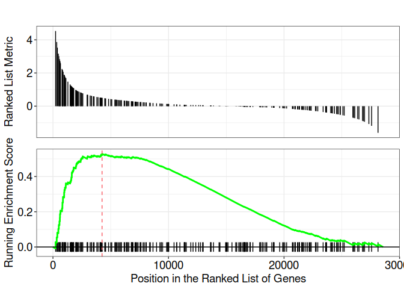<!-- -->

Calcium signaling pathway

``` r
pathview(gene.data = foldchanges,
         pathway.id = "hsa04020",
         species = "hsa",
         limit = list(gene=2, cpd=1))
```


Running GSEA again but with a higher cut-off we see ferroptosis
(*hsa04216*) as a data set non significantly enriched:

``` r
gseaKEGG <- gseKEGG(geneList = foldchanges, 
                      organism = "hsa", 
                      minGSSize = 15, 
                      pvalueCutoff = 0.8,
                      verbose = FALSE)

gseaKEGG_results <- gseaKEGG@result
rownames(gseaKEGG_results) <- NULL

gseaKEGG_results[which(gseaKEGG_results$ID == 'hsa04216'),]
```

    ##           ID Description setSize enrichmentScore      NES    pvalue  p.adjust
    ## 194 hsa04216 Ferroptosis      39       0.4284868 1.036008 0.4197349 0.7059494
    ##       qvalues rank                   leading_edge
    ## 194 0.6044827 5566 tags=38%, list=19%, signal=31%
    ##                                                                      core_enrichment
    ## 194 3162/6520/55240/2729/23657/7417/7037/643246/5094/23516/2180/8031/30061/2512/5093

## Conclusion

Differential expression analysis with DESeq2 has shown 9 significant DE
genes associated with ferroptosis. However, functional analysis with
ClusterProfiler has not highlighted GO term for ferroptosis among
enriched ontologies neither its genes. Gene Set Enrichment Analysis
using KEGG has presented enrichment for ferroptosis as not
significative. It is therefore plausible that treatment with sevoflurane
does not interact with the expression of genes associated with
ferroptosis.
